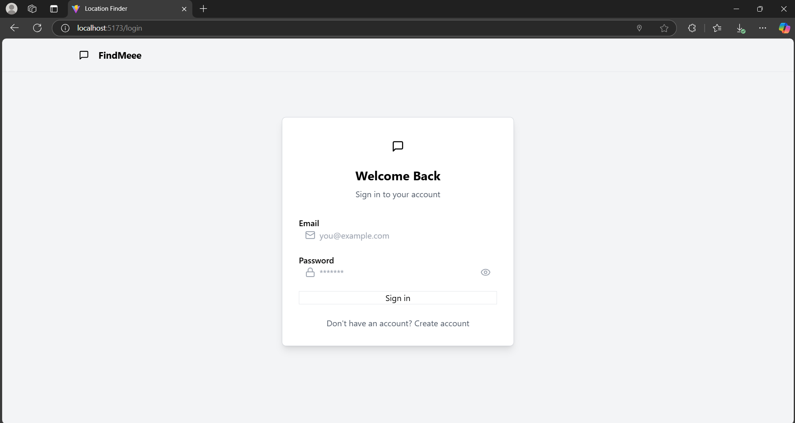
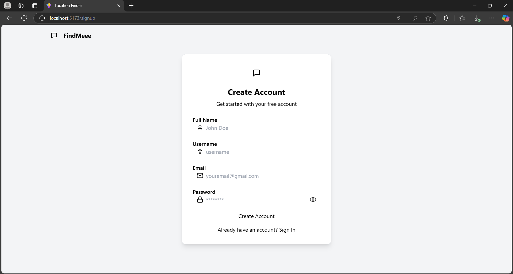
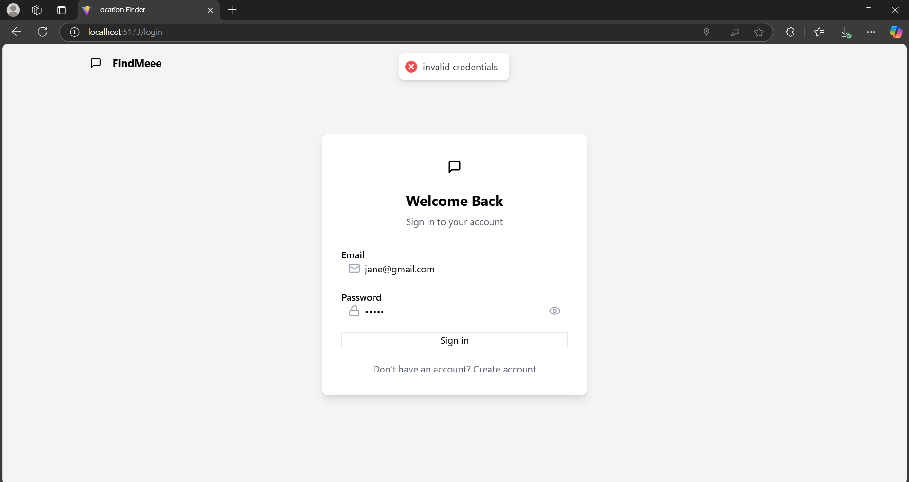
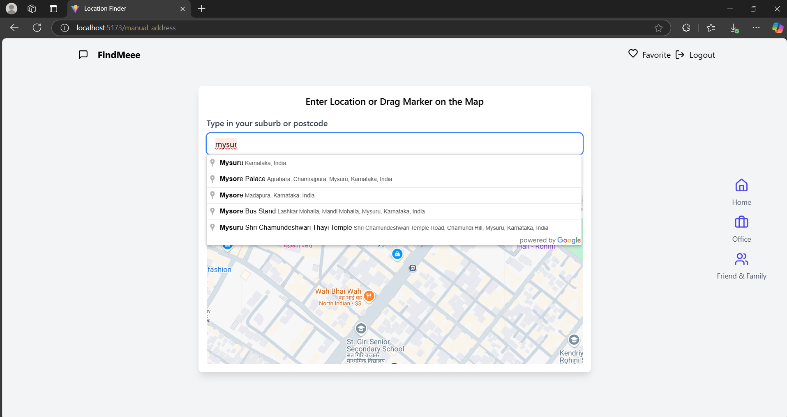
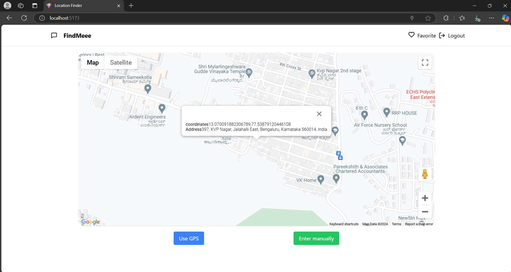

# Google Places and Map App (MERN Stack)

This is a full-stack web application built using **MERN** (MongoDB, Express, React, Node.js), **Zustand** for state management, and **Tailwind CSS** for styling. The app integrates the **Google Places API** and **Google Maps JavaScript API** to provide users with the ability to:

- Display their **current location** on the map.
- Search and type a location manually to view its position on the map.

---

## Key Features

- **Current Location**: The app automatically fetches and displays the user's current location using the Google Maps JavaScript API.
- **Manual Location Search**: Users can type a place or address, and the app uses Google Places API to search for the location and show it on the map.
- **State Management**: Zustand is used for managing and sharing state across the application, ensuring seamless updates between components.
- **Responsive UI**: Designed with Tailwind CSS to ensure a smooth, mobile-first, and responsive experience.

---

## Tech Stack

### Frontend:
- **React.js** for building interactive UI components.
- **Zustand** for lightweight state management.
- **Tailwind CSS** for responsive and utility-first styling.

### Backend:
- **Node.js** and **Express** to handle API requests and serve the application.
- **MongoDB** to store user preferences or any other relevant data.

---

# Environment Variables in Frontend

- **VITE_GOOGLE_API_KEY1**: enter your google map api key  
- **VITE_MAP_ID**:  

Refer to the [Google Maps API documentation](https://developers.google.com/maps/documentation) for more information.

---

# Environment Variables in Backend

- **PORT**:  
- **MONGO_URI**:  
- **JWT_SECRET**:  
- **NODE_ENV**:

## Project Images 

# login page

# Signup page

# Credential validation

# Google Place API listing suggestion similar to user input

# Using GPS to set current location using google Map Javascript API

## Live Link 
- **https://mern-app-with-google-map-api.onrender.com**

